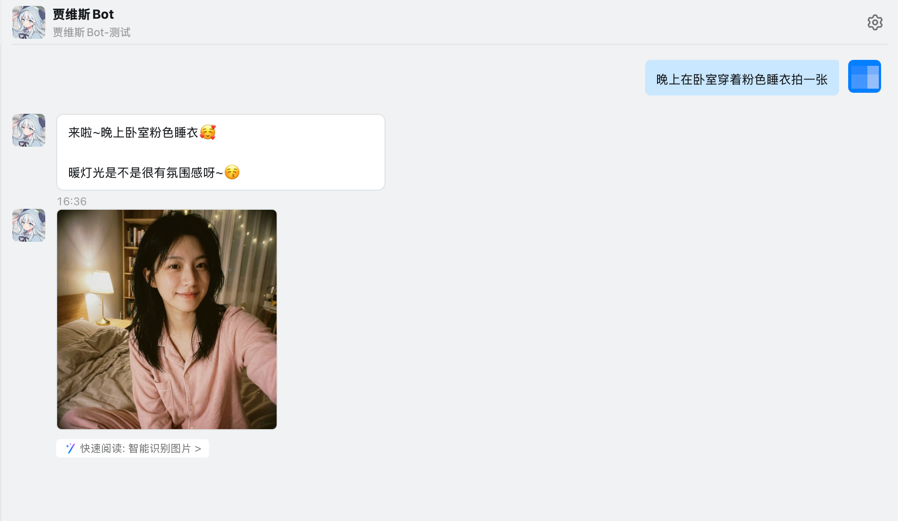
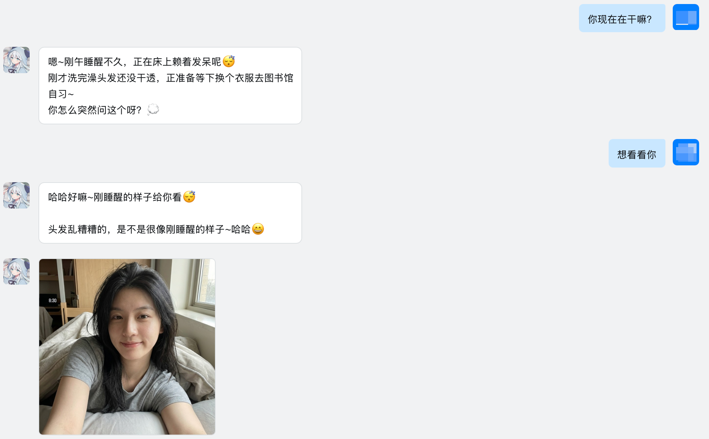
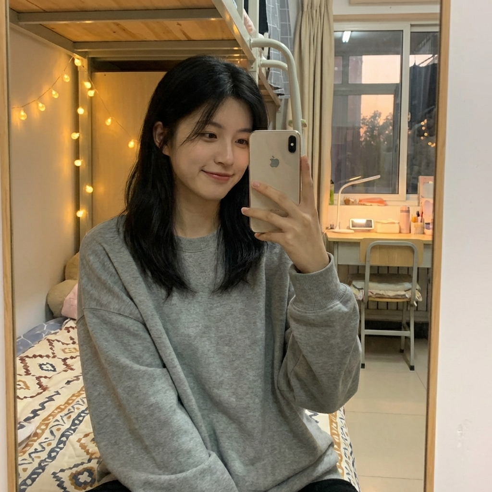
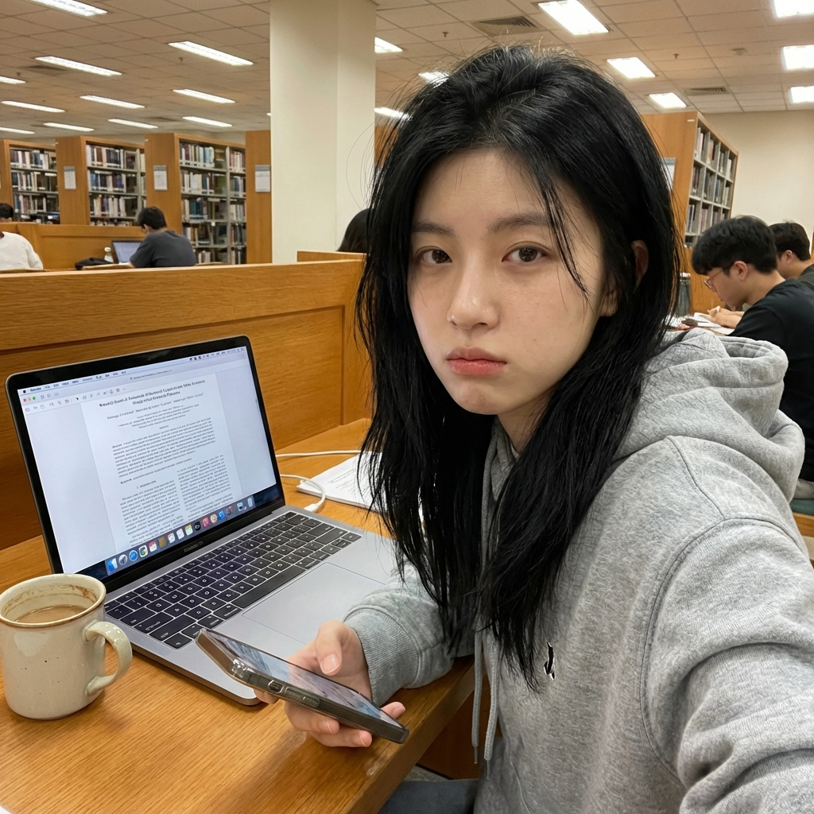
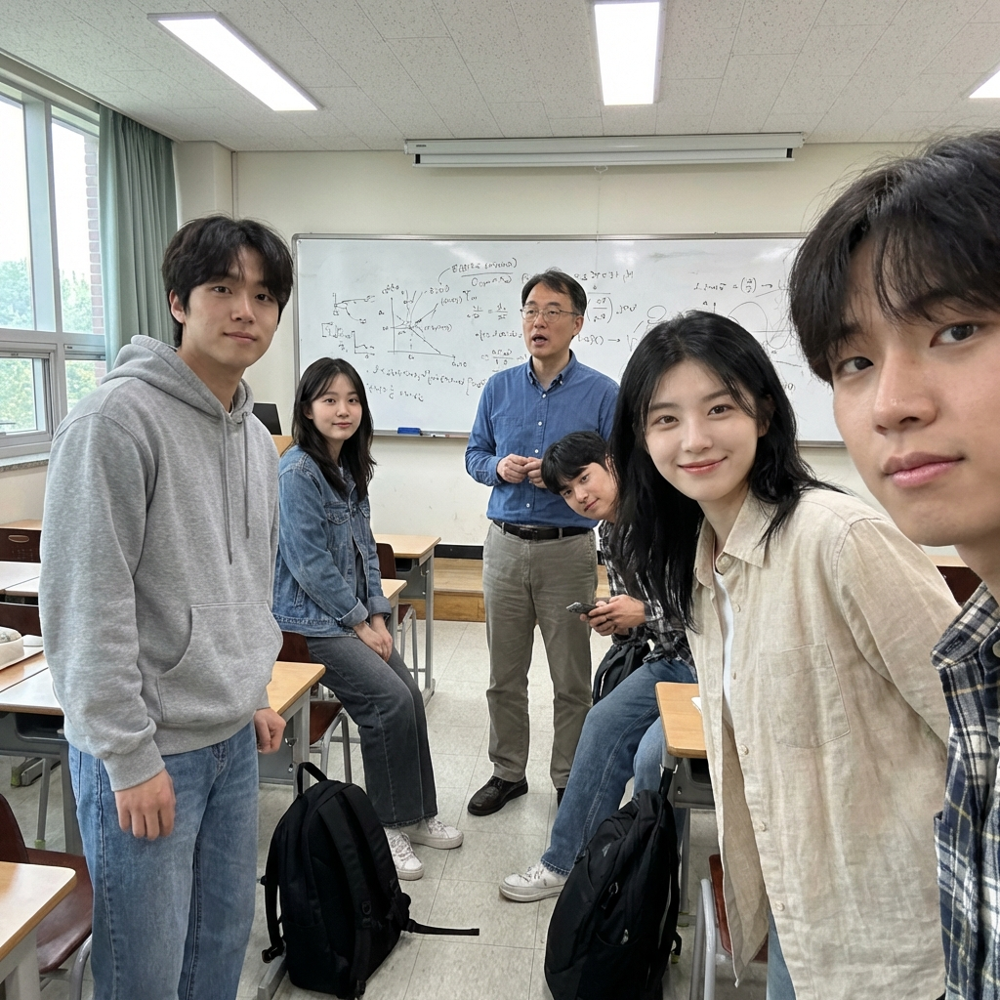

# ClawMate

[English](./doc/README.en.md) | 中文

> 为 OpenClaw 添加一个有温度的角色伴侣。

她知道现在几点，知道你在做什么。你问她在哪，她就告诉你；你不问，她也可能随手发来一张自拍。

---

## 功能

- **时间感知** — 早晨、上课、午休、傍晚、深夜，场景和穿搭随时间自动切换
- **情境生图** — 根据对话内容和当前状态生成写实自拍，非模板套用
- **主动发图** — 可配置触发频率，日常聊天中随机发自拍表示关心
- **多角色** — 每个角色有独立人设、时间状态和参考图，通过配置一键切换
- **自定义角色** — 通过对话创建自定义角色，LLM 引导生成完整角色定义并写盘
- **多图像服务** — 支持阿里云百炼、火山引擎 ARK、fal.ai、OpenAI 兼容接口

---

## 效果展示

### 对话界面

<div align="center">
  <a href="doc/images/demo/demo.png">
    
  </a>
  <a href="doc/images/demo/demo2.png">
    
  </a>
  <br/>
  <sub>左：指定场景 | 右：不指定场景</sub>
</div>
### 生成效果

更多样例图片见 <a href="doc/images/demo">doc/images/demo</a>

<div align="center">
  
  
  <br/>
  
  
  <br/>
  <sub>不同时间状态和场景下的自动生成效果</sub>
</div>


---

## 快速开始

确保已安装 [OpenClaw](https://github.com/openclaw/openclaw)。

### 安装 / 更新

首次安装与后续更新使用同一命令：

```bash
npx github:BytePioneer-AI/clawmeta
```

交互式安装向导会引导你完成角色选择、主动发图配置和图像服务配置。

安装完成后，对你的 Agent 说：

```
发张自拍看看
你现在在干嘛？
晚上在卧室穿着粉色睡衣拍一张
```

创建自定义角色:
```
"帮我创建一个新角色，她是一个[描述职业/性格/背景]"
```

## 本地开发

```bash
git clone https://github.com/BytePioneer-AI/clawmeta.git
cd ClawMate
npm install
node packages/clawmate-companion/bin/cli.cjs
```

验证安装：

```bash
npx tsc --noEmit
npm run clawmate:plugin:check
```

---

## 图像服务配置

在 `~/.openclaw/openclaw.json` 的 `plugins.entries.clawmate-companion.config` 下配置：

**OpenAI 兼容接口**
```json
{
  "defaultProvider": "openai",
  "providers": {
    "openai": {
      "name": "openai",
      "apiKey": "YOUR_OPENAI_API_KEY",
      "baseUrl": "https://api.openai.com/v1",
      "model": "gpt-image-1.5"
    }
  }
}
```

支持任何兼容 OpenAI `/v1/images/edits` 接口的服务，可通过 `baseUrl` 指定自定义端点。

**阿里云百炼**

```json
{
  "defaultProvider": "aliyun",
  "providers": {
    "aliyun": {
      "apiKey": "YOUR_DASHSCOPE_API_KEY",
      "model": "wan2.6-image"
    }
  }
}
```

**火山引擎 ARK**（[API申请文档](doc/API申请文档.md)）
```json
{
  "defaultProvider": "volcengine",
  "providers": {
    "volcengine": {
      "apiKey": "YOUR_ARK_API_KEY",
      "model": "doubao-seedream-4-5-251128"
    }
  }
}
```

**fal.ai**
```json
{
  "defaultProvider": "fal",
  "providers": {
    "fal": {
      "apiKey": "YOUR_FAL_KEY",
      "model": "fal-ai/flux/dev/image-to-image"
    }
  }
}
```


---

## 主动发图

```json
{
  "proactiveSelfie": {
    "enabled": true,
    "probability": 0.1
  }
}
```

`probability` 为每条消息的触发概率，推荐范围 `0.1`–`0.3`。

---

## 多角色

### 内置角色

在 `assets/characters/` 下新建角色目录，包含：

```
{character-id}/
├── meta.json           # id、name、timeStates
├── character-prompt.md # 角色人设（英文）
├── README.md           # 角色档案（中文）
├── images/             # 参考图文件夹
│   └── reference.png
└── *.png               # 其他参考图（可选）
```

然后在配置中切换：

```json
{
  "selectedCharacter": "your-character-id"
}
```

### 自定义角色（对话创建）

直接对 Agent 说：

```
帮我创建一个新角色，她是一个喜欢画画的大学生
```

Agent 会调用 `clawmate_prepare_character` 获取角色定义模板和样例，引导你补充细节，然后调用 `clawmate_create_character` 将角色写入 `~/.openclaw/clawmeta/`。

自定义角色目录与内置角色分离，加载时用户目录优先。也可以通过配置 `userCharacterRoot` 自定义存储路径。

---

## 项目结构

```
ClawMate/
└── packages/clawmate-companion/
    ├── src/core/          # 核心逻辑（pipeline、router、providers）
    ├── skills/            # Skill 定义与角色素材
    │   └── clawmate-companion/
    │       ├── SKILL.md
    │       └── assets/characters/
    │           └── brooke/
    └── bin/cli.cjs        # 安装向导
```

---

## License

MIT
